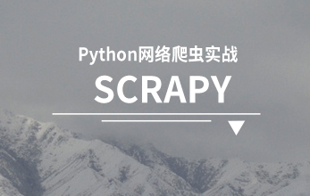
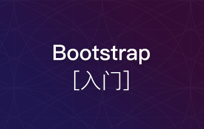

#Python Web开发

  国内最完整python开发视频教程，由资深python工程师系统讲解，从python基础教程到python开发实战，应有尽有，让您迅速实现从入门到精通的转变，并有机会获得麦子学院推荐高薪就业。

##第一阶段：python基础准备

  本阶段主要是学习python开发入门知识，html+css、javascript、jquery、python编程基础、python初探等，让你轻松入门python语言。

](http://www.maiziedu.com/course/425/)

### [Web前端开发之HTML+CSS基础入门](http://www.maiziedu.com/course/425/)

](http://www.maiziedu.com/course/302/)

### [Javascript初步](http://www.maiziedu.com/course/302/)

](http://www.maiziedu.com/course/303/)

### [jquery入门](http://www.maiziedu.com/course/303/)

](http://www.maiziedu.com/course/545/)

### [Python 面向对象编程](http://www.maiziedu.com/course/545/)

](http://www.maiziedu.com/course/393/)

### [Python课程初探](http://www.maiziedu.com/course/393/)

##第二阶段：Pythonweb开发

  本阶段是主要Python开发基础知识的讲解，通过系统学习mysql数据库、django、ajax、Tornado入门、个人博客系统实战等相关技术，全面掌握python基础开发技能技巧。

](http://www.maiziedu.com/course/306/)

### [Mysql基础](http://www.maiziedu.com/course/306/)

](http://www.maiziedu.com/course/307/)

### [django基础](http://www.maiziedu.com/course/307/)

已更新：27章

](http://www.maiziedu.com/course/308/)

### [django进阶](http://www.maiziedu.com/course/308/)

](http://www.maiziedu.com/course/305/)

### [ajax入门](http://www.maiziedu.com/course/305/)

](http://www.maiziedu.com/course/311/)

### [django缓存优化](http://www.maiziedu.com/course/311/)

](http://www.maiziedu.com/course/310/)

### [django项目部署](http://www.maiziedu.com/course/310/)

](http://www.maiziedu.com/course/314/)

### [python-Tornado](http://www.maiziedu.com/course/314/)

](http://www.maiziedu.com/course/309/)

### [项目实战：Django个人博客系统](http://www.maiziedu.com/course/309/)

](http://www.maiziedu.com/course/544/)

### [django项目实战之购物系统](http://www.maiziedu.com/course/544/)

已更新：18章

](http://www.maiziedu.com/course/782/)

### [Git 与 GitHub](http://www.maiziedu.com/course/782/)

已更新：20章

##第三阶段：Python扩展开发

  本阶段Python 开发进阶，主要是Python开发实战讲解，针对有一定Python开发基础学员，从Tkinter桌面编程、Python开发跨平台的记事本、编程实战、python爬虫、论坛项目实战等方面深入讲解，让学员快速精通python开发语言。

](http://www.maiziedu.com/course/457/)

### [Tkinter桌面编程](http://www.maiziedu.com/course/457/)

](http://www.maiziedu.com/course/460/)

### [项目-Python开发跨平台的记事本](http://www.maiziedu.com/course/460/)

](http://www.maiziedu.com/course/573/)

### [Python 数据库编程](http://www.maiziedu.com/course/573/)

](http://www.maiziedu.com/course/644/)

### [Python :socket and threading](http://www.maiziedu.com/course/644/)

](http://www.maiziedu.com/course/458/)

### [Python网络爬虫实战-Scrapy](http://www.maiziedu.com/course/458/)

](http://www.maiziedu.com/course/577/)

### [使用pyqt开发windows gui程序及打包](http://www.maiziedu.com/course/577/)

##第四阶段：Python开发选修

  本节阶段是Python开发的一个拓展讲解，主要是Linux系统、Flask框架、redis框架、node.js框架、html5+css3等相关系统和框架及技术方面的结合使用学习，让精通python开发的你，技艺更加精湛。

](http://www.maiziedu.com/course/395/)

### [Mongodb最佳实践](http://www.maiziedu.com/course/395/)

](http://www.maiziedu.com/course/313/)

### [Flask入门](http://www.maiziedu.com/course/313/)

](http://www.maiziedu.com/course/304/)

### [bootstrap入门](http://www.maiziedu.com/course/304/)

](http://www.maiziedu.com/course/312/)

### [Linux基础](http://www.maiziedu.com/course/312/)

](http://www.maiziedu.com/course/337/)

### [Redis入门](http://www.maiziedu.com/course/337/)

](http://www.maiziedu.com/course/572/)

### [深度学习进阶：算法与应用](http://www.maiziedu.com/course/572/)

](http://www.maiziedu.com/course/342/)

### [用Meteor构建App程序](http://www.maiziedu.com/course/342/)

](http://www.maiziedu.com/course/373/)

### [深度学习基础介绍-机器学习](http://www.maiziedu.com/course/373/)

](http://www.maiziedu.com/course/494/)

### [Bottle Web开发](http://www.maiziedu.com/course/494/)

](http://www.maiziedu.com/course/568/)

### [自动化测试-selenium](http://www.maiziedu.com/course/568/)

](http://www.maiziedu.com/course/576/)

### [python自动化运维+web监控系统](http://www.maiziedu.com/course/576/)

](http://www.maiziedu.com/course/581/)

### [Javascript 进阶](http://www.maiziedu.com/course/581/)

](http://www.maiziedu.com/course/591/)

### [MemCache](http://www.maiziedu.com/course/591/)

](http://www.maiziedu.com/course/645/)

### [Python 爬虫基础](http://www.maiziedu.com/course/645/)

](http://www.maiziedu.com/course/661/)

### [单元测试](http://www.maiziedu.com/course/661/)

](http://www.maiziedu.com/course/673/)

### [Python3.X新特性](http://www.maiziedu.com/course/673/)

](http://www.maiziedu.com/course/688/)

### [paramiko基础](http://www.maiziedu.com/course/688/)

](http://www.maiziedu.com/course/692/)

### [Python自动化开发-类Zabbix监控项目](http://www.maiziedu.com/course/692/)

](http://www.maiziedu.com/course/709/)

### [Python数据可视化分析 ##matplotlib](http://www.maiziedu.com/course/709/)

](http://www.maiziedu.com/course/726/)

### [Python :Pexpect库应用](http://www.maiziedu.com/course/726/)

](http://www.maiziedu.com/course/734/)

### [Echarts和highcharts的使用](http://www.maiziedu.com/course/734/)

](http://www.maiziedu.com/course/747/)

### [Gevent](http://www.maiziedu.com/course/747/)

](http://www.maiziedu.com/course/751/)

### [pandas教程](http://www.maiziedu.com/course/751/)

](http://www.maiziedu.com/course/793/)

### [Fabric教程](http://www.maiziedu.com/course/793/)

](http://www.maiziedu.com/course/801/)

### [小麦听书](http://www.maiziedu.com/course/801/)

