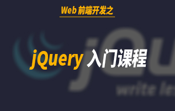
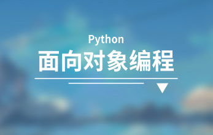
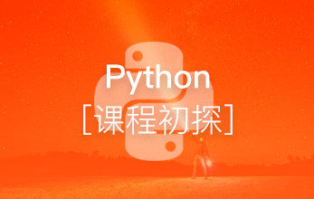

# 第一阶段：python基础准备

  本阶段主要是学习python开发入门知识，html+css、javascript、jquery、python编程基础、python初探等，让你轻松入门python语言。
  

## [Web前端开发之HTML+CSS基础入门](http://www.maiziedu.com/course/425/)

## [Javascript初步](http://www.maiziedu.com/course/302/)

## [jquery入门](http://www.maiziedu.com/course/303/)

## [Python 面向对象编程](http://www.maiziedu.com/course/545/)

## [Python课程初探](http://www.maiziedu.com/course/393/)

