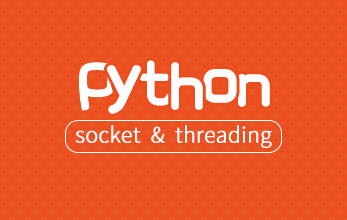

# 第三阶段：Python扩展开发

  本阶段Python 开发进阶，主要是Python开发实战讲解，针对有一定Python开发基础学员，从Tkinter桌面编程、Python开发跨平台的记事本、编程实战、python爬虫、论坛项目实战等方面深入讲解，让学员快速精通python开发语言。

## [Tkinter桌面编程](http://www.maiziedu.com/course/457/)

## [项目-Python开发跨平台的记事本](http://www.maiziedu.com/course/460/)

## [Python 数据库编程](http://www.maiziedu.com/course/573/)

## [Python :socket and threading](http://www.maiziedu.com/course/644/)

## [Python网络爬虫实战-Scrapy](http://www.maiziedu.com/course/458/)

## [使用pyqt开发windows gui程序及打包](http://www.maiziedu.com/course/577/)

