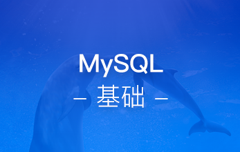

# 第二阶段：Pythonweb开发

  本阶段是主要Python开发基础知识的讲解，通过系统学习mysql数据库、django、ajax、Tornado入门、个人博客系统实战等相关技术，全面掌握python基础开发技能技巧。

## [Mysql基础](http://www.maiziedu.com/course/306/)

## [django基础](http://www.maiziedu.com/course/307/)

## [django进阶](http://www.maiziedu.com/course/308/)

## [ajax入门](http://www.maiziedu.com/course/305/)

## [django缓存优化](http://www.maiziedu.com/course/311/)

## [django项目部署](http://www.maiziedu.com/course/310/)

## [python-Tornado](http://www.maiziedu.com/course/314/)

## [项目实战：Django个人博客系统](http://www.maiziedu.com/course/309/)

## [django项目实战之购物系统](http://www.maiziedu.com/course/544/)

## [Git 与 GitHub](http://www.maiziedu.com/course/782/)

